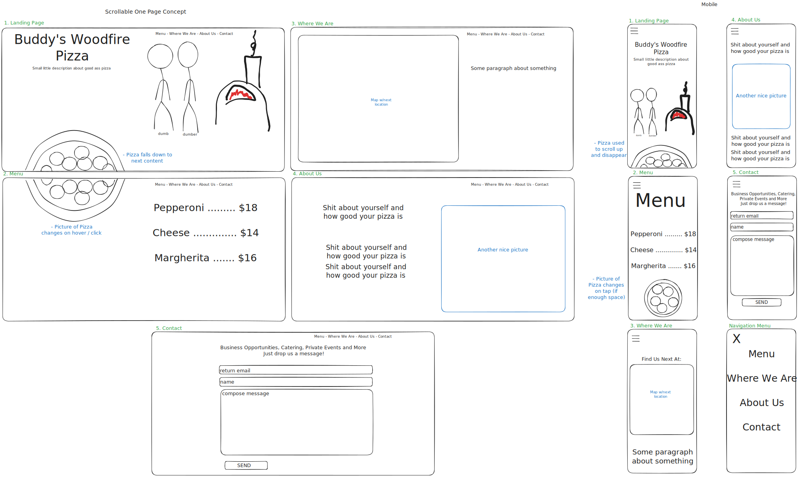
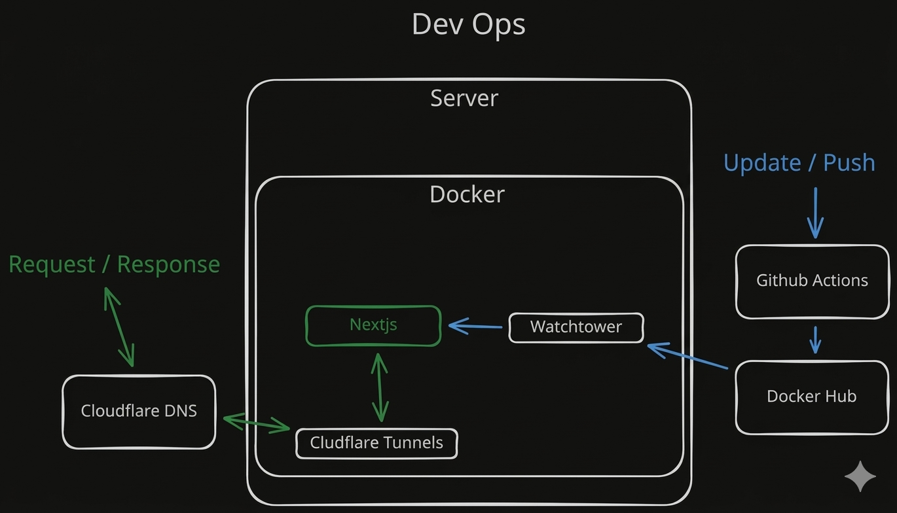

# Buddy's Pizza

Pizza website to show the location and menu

## Start Server

This repo contains a docker image to easily host anywhere just run:

```
# bash
docker build -t next-site . && docker run -p 4080:4080 --rm next-site
```

Alternatively you can use Docker Compose:

Example YAML

```
version: "3.8"

services:
  pizza-website:
    image: agigglesniffer/buddyspizza:latest
    container_name: pizza-website
    ports:
      - "4080:4080"
    restart: unless-stopped
```

```
# bash
docker compose up
```

## Develop

1. Clone repo

2. Install Dependencies using [pnpm](https://pnpm.io/installation)

```
# bash
pnpm install
```

3. Compile changes
   - This will run the linter and formatter as well.

```
# bash
pnpm build
```

4. Run Dev Server

```
# bash
pnpm dev
```

5. Push and merge to main to auto trigger CI/CD pipepline

## Wireframe



## DevOps

### Automatic Updates

1. Pushing to main triggers a [Github Action](https://github.com/AGiggleSniffer/buddyspizza/tree/main/.github/workflows) to build the docker image and upload it to [Docker Hub](https://hub.docker.com/r/agigglesniffer/buddyspizza)

2. [Watchtower](https://containrrr.dev/watchtower/) checks for updates in a seperate docker container and handles remaking the container with almost no downtime


